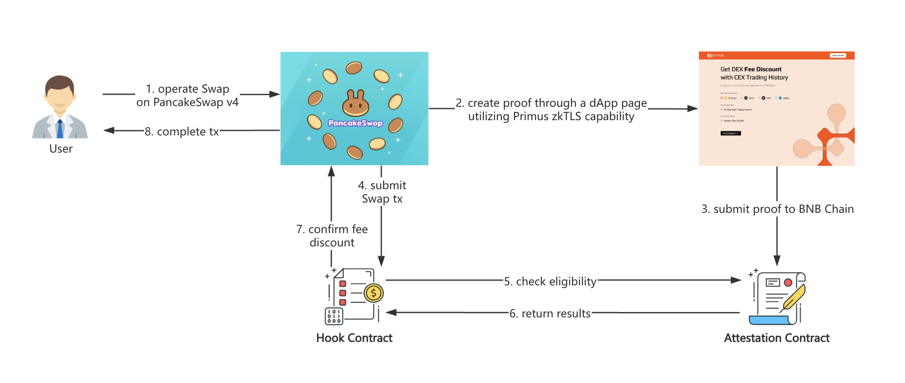

# CEX Trading Hooks For PancakeSwap V4

## Overview

This repository provides a simple demo for PancakeSwap v4, allowing users to verify their 30-day CEX spot trading volume to qualify for a swap fee discount. If a user verifies and submits a successful 30-day CEX trading volume exceeding the threshold of 10k to the BNB Chain, the hook contract will validate the information. When the user performs a swap on PancakeSwap, the contract will apply a fee discount—currently set at 50%—once the conditions are confirmed to be met.

The user can generate a CEX trading proof through an external [link](https://pancakeswapv4-hook.primuslabs.xyz/) on the Swap page, which redirects them to a dApp page utilizing the [Primus zkTLS capability](https://docs.primuslabs.xyz/data-verification/tech-intro) to complete the data verification process. Throughout the entire process, the user’s privacy is fully protected.




## Prerequisite

Install foundry, see https://book.getfoundry.sh/getting-started/installation.

## Install

Get the repo:

```sh
git clone --recursive https://github.com/primus-labs/pancake-transaction-oracle-hooks.git
cd pancake-transaction-oracle-hooks
forge install
forge build
```

## Primus AttestionRegistry

The [AttestationRegistry](src/attestation/AttestationRegistry.sol) contract is used to register the attestation contract.

[AttestationRegistry Contract](./docs/src/src/attestation/AttestationRegistry.sol/contract.AttestationRegistry.md)


## CLExchangeVolumeHook

The [CLExchangeVolumeHook](src/pool-cl/volume/CLExchangeVolumeHook.sol) implements the `afterInitialize` and `beforeSwap` hooks.

[CLExchangeVolumeHook Contract](./docs/src/src/pool-cl/volume/CLExchangeVolumeHook.sol/contract.CLExchangeVolumeHook.md)

## BinExchangeVolumeHook

The [BinExchangeVolumeHook](src/pool-bin/volume/BinExchangeVolumeHook.sol) implements the `afterInitialize` and `beforeSwap` hooks.

[BinExchangeVolumeHook Contract](./docs/src/src/pool-bin/volume/BinExchangeVolumeHook.sol/contract.BinExchangeVolumeHook.md)

## BNBChain-Testnet

### Configurations

1. Copy `./.env.bsc-testnet` to `./.env`, and set your private key (`PRIVATE_KEY`).
2. The following parameters are already set:
   - Pancake Swap ([Vault](https://testnet.bscscan.com/address/0xd557753bde3f0EaF32626F8681Ac6d8c1EBA2BBa), [CLPoolManager](https://testnet.bscscan.com/address/0x70890E308DCE727180ac1B9550928fED342dea52), [CLPositionManager](https://testnet.bscscan.com/address/0x7E7856fBE18cd868dc9E2C161a7a78c53074D106), [UniversalRouter](https://testnet.bscscan.com/address/0x1c3112A0A62563F02D44659E6340409E02B6c02f)).
   - The arguments of Hook ([AttestationRegistry](https://testnet.bscscan.com/address/0x9109Ea5A8Af5c3c5600F6E8213bd83348C81a573)).


### Deployment


- Deploy Token


```sh
source .env
forge script script/DeployToken.s.sol --rpc-url $RPC_URL --private-key $PRIVATE_KEY --broadcast
```

output (sample):

```log
TOKEN0=0x772F5b156EDaa4874F3f4F81c5e4479EE7E1669B
TOKEN1=0x7AA33Aa23aB75D37A9c27B0ba51bb10ed6e41a51
```

Add/replace the above address in `.env`.

<br/>

- Deploy AttestationRegistry

```sh
source .env
forge script script/attestation/AttestationRegistry.s.sol --rpc-url $RPC_URL --private-key $PRIVATE_KEY --broadcast
```

output (sample):

```log
ATTESTATION_REGISTRY=0x6c2270298b1e6046898a322acB3Cbad6F99f7CBD
```

<br/>

- Deploy Hook

```sh
source .env
forge script script/pool-cl/DeployHook.s.sol --rpc-url $RPC_URL --private-key $PRIVATE_KEY --broadcast
```

output (sample):

```log
HOOK=0xd9Dd1FEaF845Dd036245A504317cCccE7Bc18f49
```

Add/replace the above address in `.env`.


### Before Testing

- Initialize Pool

```sh
source .env
forge script script/pool-cl/Test.s.sol:TestInitializeScript --rpc-url $RPC_URL --private-key $PRIVATE_KEY --gas-estimate-multiplier 600 --broadcast
```

This command only needs to be executed once.

<br/>

- Transfer Token (Optional)

Request some tokens from the Token owner. (If necessary)

```sh
source .env
export RECEIVER=<the receiver address>
# export RECEIVER=0x...
forge script script/Transfer.s.sol --rpc-url $RPC_URL --private-key $PRIVATE_KEY --broadcast
```

<br/>

- Token Approve

Before swap testing, need approve first.

```sh
source .env
forge script script/Approve.s.sol --rpc-url $RPC_URL --private-key $PRIVATE_KEY --broadcast
```

### Testing

- Test AddLiquidity

```sh
source .env
forge script script/pool-cl/Test.s.sol:TestAddLiquidityScript --rpc-url $RPC_URL --private-key $PRIVATE_KEY --broadcast
```

<br/>

- Test Swap

```sh
source .env
forge script script/pool-cl/Test.s.sol:TestSwapScript --rpc-url $RPC_URL --private-key $PRIVATE_KEY --broadcast
```
