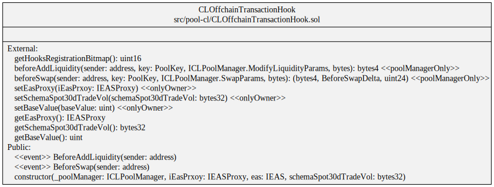

# pancake-offchaindata-hooks

## Overview

This repo creates a simple demo on a compliant DEX pool, using off-chain data attestations and the Hook feature in PancakeUniswap v4. We emphasise this repo is a prototype only, please don't use it in any product environment. 

Off-chain data attestations are privacy-preserving data proofs created by end users, through the [PADO](https://padolabs.org) protocol. PADO is a cryptographic attestation protocol to bring all Internet data into smart contracts.

The demo implements the following [proposal](https://hackmd.io/QXi9YUvUSwmqxCuGl7Z9XA), where users with submitted proofs-of-KYC-status can be privileged to swap tokens on DEX. This enables new scenarios like institutional swaps.


Besides the demo, PADO is an attestation protocol to support:
1. connecting with arbitrary data sources from TLS transmission, and proving the data authenticity;
2. general-purpose data computation with zkSNARKs;
3. high performance on any end-to-end process; 


## Prerequisite

Install foundry, see https://book.getfoundry.sh/getting-started/installation.

## Install

Get the repo:

```sh
git clone --recursive https://github.com/pado-labs/pancake-offchaindata-hooks.git
cd pancake-offchaindata-hooks
forge install
forge build
```

## Off-chain Transaction Hook

The [Off-chain Transaction Hook](./src/pool-cl/CLOffchainTransactionHook.sol) implements the `beforeAddLiquidity` and `beforeSwap` hooks.


