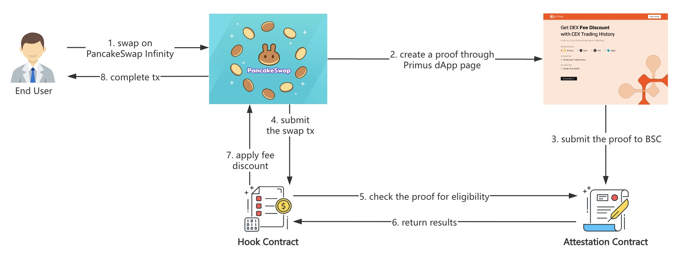

# CEX Trading Hooks For PancakeSwap Infinity

## Overview

This repository introduces a CEX trading hook for PancakeSwap Infinity, enabling users to validate their 30-day spot trading volume across centralized exchanges (CEXs) to become eligible for a swap fee discount. Specifically, if a user generates and submits a proof (attestation) of their 30-day CEX trading volume exceeding a specified USDT threshold to the BNB Chain, and this proof is successfully verified by the hook contract, the user will enjoy a 50% discount on swapping fees on PancakeSwap for a period of 7 days.

As a pool initiator, you can invoke this hook into your own pool on PancakeSwap Infinity, to capture high-quality trading users and relevant trading volume from centralized exchanges. Once the hook is bound to a designated pool (token pair), end users will find an external link on the PancakeSwap Infinity trade page. This link directs them through the data verification process using the [Primus zkTLS technique](https://docs.primuslabs.xyz/data-verification/tech-intro). Meanwhile, all sensitive information related to the generated proof—including total trading volume and account details—remains entirely confidential. Neither Primus nor the pool initiator will have access to this private data at any point during the process.




## For Developers

### Prerequisite

Install foundry, see https://book.getfoundry.sh/getting-started/installation.

### Install

Get the repo:

```sh
git clone --recursive https://github.com/primus-labs/pancake-transaction-oracle-hooks.git
cd pancake-transaction-oracle-hooks
forge install
forge build
```

### Primus AttestionRegistry

This contract records the proofs (attestations) generated by users about their 30-day CEX spot trading volume, using the Primus zkTLS technique.

The [AttestationRegistry](src/attestation/AttestationRegistry.sol) contract is used to register the attestation contract.

Below is a detailed introduction to the contract.

[AttestationRegistry Contract](./docs/src/src/attestation/AttestationRegistry.sol/contract.AttestationRegistry.md)


### CLExchangeVolumeHook

This is the specific Hook for CL pools that checks for the trading history from CEX users.

The [CLExchangeVolumeHook](src/pool-cl/volume/CLExchangeVolumeHook.sol) implements the `afterInitialize` and `beforeSwap` hooks.

This is a detailed introduction to the contract: [CLExchangeVolumeHook Contract](./docs/src/src/pool-cl/volume/CLExchangeVolumeHook.sol/contract.CLExchangeVolumeHook.md)

### BinExchangeVolumeHook

This is the specific Hook for Bin pools that checks for the trading history from CEX users.

The [BinExchangeVolumeHook](src/pool-bin/volume/BinExchangeVolumeHook.sol) implements the `afterInitialize` and `beforeSwap` hooks.

This is a detailed introduction to the contract: [BinExchangeVolumeHook Contract](./docs/src/src/pool-bin/volume/BinExchangeVolumeHook.sol/contract.BinExchangeVolumeHook.md)

### Test Guide

Please follow the steps below to perform the test.

### Configurations

Configure the contract address, private key, RPC, and other settings.

1. Copy `./.env.bsc-testnet` to `./.env`, and set your private key (`PRIVATE_KEY`).
2. The following parameters are already set:
   - Pancake Swap ([Vault](https://testnet.bscscan.com/address/0xd557753bde3f0EaF32626F8681Ac6d8c1EBA2BBa), [CLPoolManager](https://testnet.bscscan.com/address/0x70890E308DCE727180ac1B9550928fED342dea52), [CLPositionManager](https://testnet.bscscan.com/address/0x7E7856fBE18cd868dc9E2C161a7a78c53074D106), [UniversalRouter](https://testnet.bscscan.com/address/0x1c3112A0A62563F02D44659E6340409E02B6c02f)).
   - The arguments of Hook ([AttestationRegistry](https://testnet.bscscan.com/address/0x9109Ea5A8Af5c3c5600F6E8213bd83348C81a573)).


### Deployment

Deploy the test token and the test Hook contract.

- Deploy Token


```sh
source .env
forge script script/DeployToken.s.sol --rpc-url $RPC_URL --private-key $PRIVATE_KEY --broadcast
```

output (sample):

```log
TOKEN0=0x772F5b156EDaa4874F3f4F81c5e4479EE7E1669B
TOKEN1=0x7AA33Aa23aB75D37A9c27B0ba51bb10ed6e41a51
```

Add/replace the above address in `.env`.

<br/>

- Deploy AttestationRegistry

```sh
source .env
forge script script/attestation/AttestationRegistry.s.sol --rpc-url $RPC_URL --private-key $PRIVATE_KEY --broadcast
```

output (sample):

```log
ATTESTATION_REGISTRY=0x6c2270298b1e6046898a322acB3Cbad6F99f7CBD
```

<br/>

- Deploy Hook

```sh
source .env
forge script script/pool-cl/DeployHook.s.sol --rpc-url $RPC_URL --private-key $PRIVATE_KEY --broadcast
```

output (sample):

```log
HOOK=0xd9Dd1FEaF845Dd036245A504317cCccE7Bc18f49
```

Add/replace the above address in `.env`.


### Initialize Pool

```sh
source .env
forge script script/pool-cl/Test.s.sol:TestInitializeScript --rpc-url $RPC_URL --private-key $PRIVATE_KEY --gas-estimate-multiplier 600 --broadcast
```

This command only needs to be executed once.

<br/>

#### Transfer Token (Optional)

Request some tokens from the Token owner. (If needed.)

```sh
source .env
export RECEIVER=<the receiver address>
# export RECEIVER=0x...
forge script script/Transfer.s.sol --rpc-url $RPC_URL --private-key $PRIVATE_KEY --broadcast
```

<br/>

#### Token Approve

Before performing a swap test, make sure to approve the token first.

```sh
source .env
forge script script/pool-cl/Approve.s.sol --rpc-url $RPC_URL --private-key $PRIVATE_KEY --broadcast
```

#### Add Liquidity

```sh
source .env
forge script script/pool-cl/Test.s.sol:TestAddLiquidityScript --rpc-url $RPC_URL --private-key $PRIVATE_KEY --broadcast
```

<br/>

#### Test Swap

```sh
source .env
forge script script/pool-cl/Test.s.sol:TestSwapScript --rpc-url $RPC_URL --private-key $PRIVATE_KEY --broadcast
```
