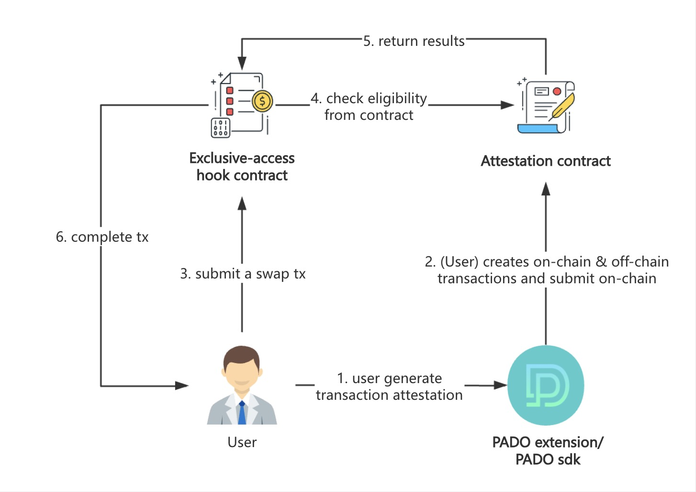
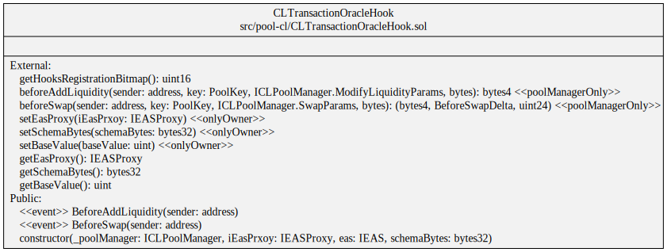

# pancake-transaction-oracle-hooks

## Overview

This repo creates a simple demo for DEX exclusive-access pools and better filters qualified users by combining off-chain and on-chain transaction data verification. This combination provides a more accurate representation of user transaction activities in a privacy-preserving way, giving applications more flexible filtering criteria. In the PancakeSwap case, a suitable exclusive-access condition could be if a user has a 30-day spot transaction volume exceeding $500 on a CEX platform and has made an on-chain transaction on the BNB Chain, making this user a target user for DEX.

In this demo, transaction proofs can be submitted from the PADO extension or utilized by PADO's MPC-TLS SDK to attest the user's on-chain and off-chain transactions. Throughout the entire process, the user’s privacy is fully protected. Whether the user meets the exclusive-access demands could be verified by this hook contract. 

To be more technique-specific, for the on-chain transaction proof, [Brevis'](https://docs.brevis.network/) SDK is used in this demo to verify whether the user has had transactions on the BNB Chain since July 2024. For off-chain transaction proof, [PADO's](https://padolabs.org) MPC-TLS and IZK techniques are used to verify whether the user’s 30-day spot transaction volume on CEX platforms, such as Binance or OKX, exceeds $500 or a specific amount, depending on the application’s requirements.

The Brevis integration repo: https://github.com/pado-labs/pado-brevis-onchain-transaction.




## Prerequisite

Install foundry, see https://book.getfoundry.sh/getting-started/installation.

## Install

Get the repo:

```sh
git clone --recursive https://github.com/pado-labs/pancake-transaction-oracle-hooks.git
cd pancake-transaction-oracle-hooks
forge install
forge build
```

## Transaction Oracle Hooks

The [Transaction Oracle Hooks](./src/pool-cl/CLTransactionOracleHook.sol) implements the `beforeAddLiquidity` and `beforeSwap` hooks.




## BSC-Testnet

### Configurations

1. Copy `./.env.bsc-testnet` to `./.env`, and set your private key (`PRIVATE_KEY`).
2. The following parameters are already set:
   - Pancake Swap ([Vault](https://testnet.bscscan.com/address/0x08F012b8E2f3021db8bd2A896A7F422F4041F131), [CLPoolManager](https://testnet.bscscan.com/address/0x969D90aC74A1a5228b66440f8C8326a8dA47A5F9), [CLPositionManager](https://testnet.bscscan.com/address/0x89A7D45D007077485CB5aE2abFB740b1fe4FF574), [UniversalRouter](https://testnet.bscscan.com/address/0x30067B296Edf5BEbB1CB7b593898794DDF6ab7c5)). 
   - The arguments of Hook ([EAS](https://testnet.bscscan.com/address/0x6c2270298b1e6046898a322acB3Cbad6F99f7CBD), [EASProxy](https://testnet.bscscan.com/address/0x620e84546d71A775A82491e1e527292e94a7165A), [SchemaBytes](https://testnet.bascan.io/schema/0x5f868b117fd34565f3626396ba91ef0c9a607a0e406972655c5137c6d4291af9)).


### Deployment


- Deploy Token


```sh
source .env
forge script script/DeployToken.s.sol --rpc-url $RPC_URL --private-key $PRIVATE_KEY --broadcast
```

output (sample):

```log
TOKEN0=0x772F5b156EDaa4874F3f4F81c5e4479EE7E1669B
TOKEN1=0x7AA33Aa23aB75D37A9c27B0ba51bb10ed6e41a51
```

Add/replace the above address in `.env`.

<br/>

- Deploy Hook

```sh
source .env
forge script script/DeployHook.s.sol --rpc-url $RPC_URL --private-key $PRIVATE_KEY --broadcast
```

output (sample):

```log
HOOK=0xd9Dd1FEaF845Dd036245A504317cCccE7Bc18f49
```

Add/replace the above address in `.env`.


### Before Testing

- Initialize Pool

```sh
source .env
forge script script/Test.s.sol:TestInitializeScript --rpc-url $RPC_URL --private-key $PRIVATE_KEY --broadcast
```

This command only needs to be executed once.

<br/>

- Transfer Token (Optional)

Request some tokens from the Token owner. (If necessary)

```sh
source .env
export RECEIVER=<the receiver address>
# export RECEIVER=0x...
forge script script/Transfer.s.sol --rpc-url $RPC_URL --private-key $PRIVATE_KEY --broadcast
```

<br/>

- Token Approve

Before swap testing, need approve first.

```sh
source .env
forge script script/Approve.s.sol --rpc-url $RPC_URL --private-key $PRIVATE_KEY --broadcast
```

### Testing

- Test AddLiquidity

```sh
source .env
forge script script/Test.s.sol:TestAddLiquidityScript --rpc-url $RPC_URL --private-key $PRIVATE_KEY --broadcast
```

<br/>

- Test Swap

```sh
source .env
forge script script/Test.s.sol:TestSwapScript --rpc-url $RPC_URL --private-key $PRIVATE_KEY --broadcast
```
